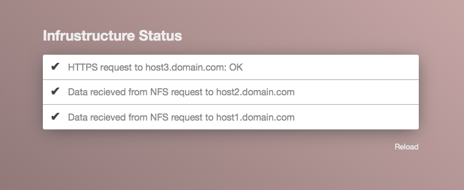

ObjStat
=======
Simple status reporting websites

Running from the command line
-----------------------------

Running objstat requires some knowledge of the checks written. 

Command line arguments are parsed directly into the checks themselves,
the _func_ parameter tells objstat which check to make use of, 3 checks are available
by default, *check_nfs*, *check_http* and *check_https*. All arguments after this initial
check specification are parsed as kwargs into the check function itself

    @staticmethod
    def check_https(host):
        ...

For example, to call a method check_https with the parameters host, we would use:

    user@host - $ objstat.py func check_https host twitter.com
    user@host - $ python -m SimpleHTTPServer
    
And navigate to <http://localhost:8000>

Configuring crontab
-------------------
Crontab can be used to automatically run checks.

	*/30 * * * * objstat.py func check_http host www.reddit.com
	*/15 * * * * objstat.py func check_https host twitter.com